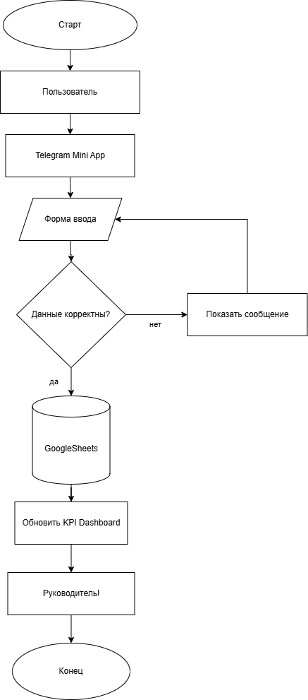

## Автоматизация сбора данных через Telegram Mini App

**О проекте**

Проект автоматизации процесса сбора и обработки данных через Telegram Mini App с последующей передачей информации в Google Sheets.

**Цель проекта** — исключить ручной ввод данных и создать единый поток информации для дальнейшей аналитики.

---

**Бизнес-задача**

**До внедрения**

- данные передавались вручную
- возникали ошибки ввода
- отсутствовал единый формат
- процесс было сложно контролировать

**После внедрения**

- единая форма ввода
- автоматическая запись данных
- контроль статусов
- прозрачность процесса

---

**Используемые инструменты**

- Telegram Mini App
- Google Forms
- Google Sheets
- Google Apps Script
- Process Automation
- Business Analysis

---

**Схема процесса**

**Анализ взаимодействия систем**

Ниже представлена схема взаимодействия пользователя, Telegram Mini App и Google Sheets в рамках автоматизации процесса сбора данных.

**Логика процесса**

1. Пользователь открывает Telegram Mini App
2. Через встроенную форму вводит необходимые данные
3. Система выполняет валидацию информации
4. При наличии ошибок пользователь получает уведомление
5. После успешной проверки данные передаются в Google Sheets
6. После записи автоматически обновляется dashboard
7. Руководитель получает актуальные показатели

**Задачи системного анализа**

В рамках проекта были определены:

- точки входа данных
- маршрут передачи информации
- правила валидации
- структура хранения данных
- сценарии обработки ошибок
- логика обновления отчетности

**Бизнес-эффект**

Реализация решения позволила:

- сократить ручной ввод данных
- снизить количество ошибок
- ускорить обновление отчетности
- повысить прозрачность процессов
- уменьшить операционную нагрузку



---

**Моя роль в проекте**

В рамках проекта выполнял функции системного анализа и проектирования решения:

- анализировал текущий процесс сбора данных
- выявлял узкие места ручной обработки
- формировал требования к форме
- определял структуру передаваемых данных
- проектировал маршрут движения информации
- описывал сценарии обработки ошибок
- участвовал в проектировании логики обновления dashboard
- контролировал корректность итогового решения

Основная задача заключалась в переводе ручного процесса в автоматизированный и прозрачный workflow.

---

**Результат проекта**

После внедрения решения удалось:

- сократить время передачи данных
- исключить двойной ввод информации
- уменьшить количество ошибок
- ускорить обновление KPI
- повысить прозрачность для руководителя

---

**Структура проекта**

```telegram-form-automation/
├── README.md
├── docs/
│   ├── business-requirements.md
│   ├── user-flow.md
│   └── data-structure.md
├── screenshots/
└── diagrams/
    └── workflow.png```
